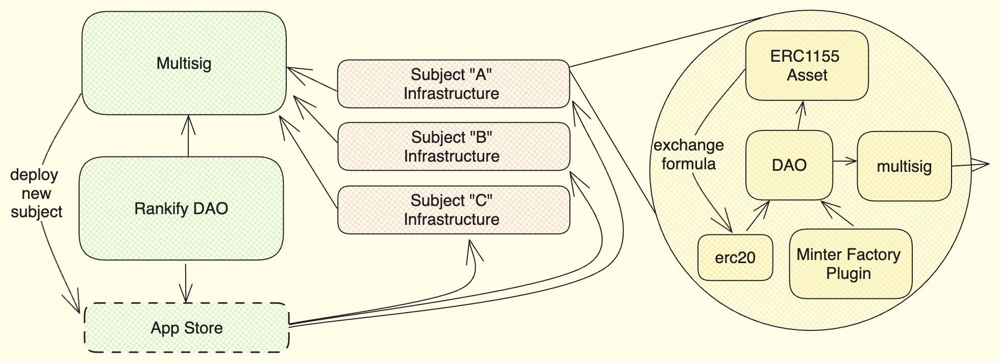
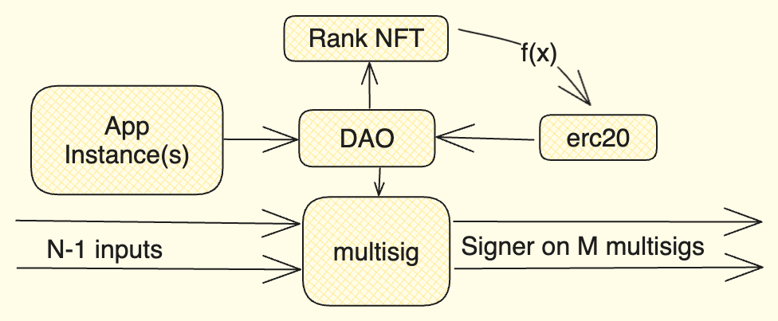
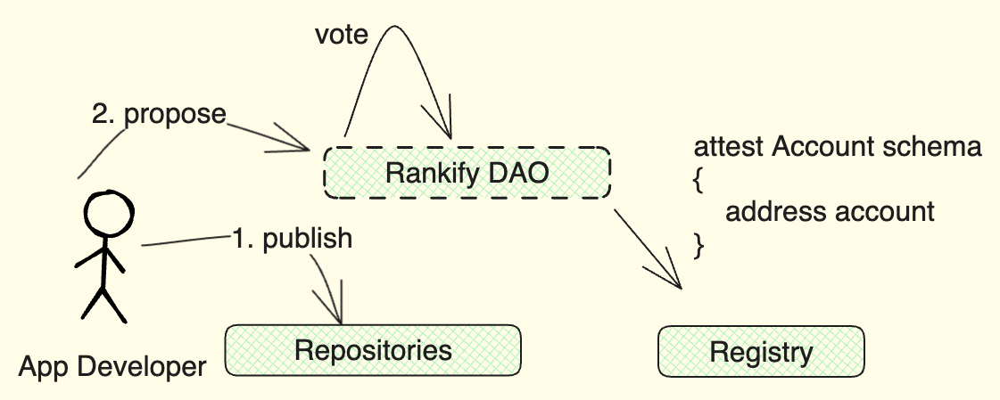
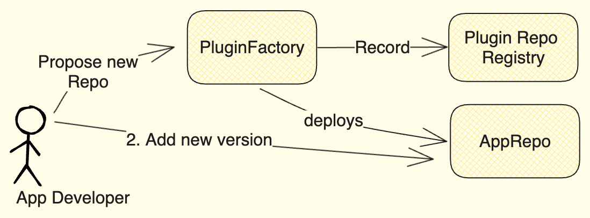
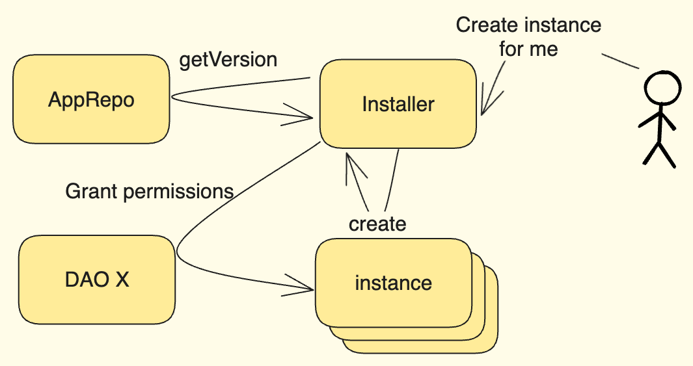

# Smart contract infrastructure

The Rankify smart contract infrastructure is built upon a modular design, emphasizing trustless operations to facilitate progressive decentralization within organizations as well as mitigate some roadblocks on wider adoption of decentralized governance.

Adhering to systems theory principles, the architecture can be understood as a black box, responding to stimuli inputs with defined output reactions, while its key feature is the support for recursive patterns, enabling iterative processes on both input and output levels.

Including governing body, infrastructure as consisting of two main pieces:

-   **App Store**: Registry of different ranking system applications that may be installed on cells
-   **Cell infrastructures**: Dimensions for ranking that participants produce.



The rankify community governing DAO and multi-sig in the image above can be seen as an instance of _Cell_ infrastructure.

## Cells

A single cell is an autonomous governance unit, structured as an NxM matrix of inputs and outputs connected to a multisig-wallet. Each cell, representing a specific topic or workgroup, leverages a modular and customizable infrastructure consisting of:

-   **Rank NFT**: A semi-fungible ERC1155 token signifying the bearer's rank within the subject.
-   **Governance Token**: An ERC20 token used for governance, minted by exchanging Rank NFTs.
-   **DAO contract**: [OSx DAO Contract](https://devs.aragon.org/docs/osx/reference-guide/core/dao/) governed entirely by holders of the governance token.
-   **App Instance**: Ranking app, implements the autonomous competence identification protocol.
-   **Multisig Wallet**: A wallet adhering to the Gnosis [ISafe](https://github.com/safe-global/safe-smart-account/blob/main/contracts/interfaces/ISafe.sol), connecting governing bodies and facilitating decision-making.



Protocol is modular and trends to support already existing multi-sig infrastructure as well as experimentation hence protocol deployed, established, and modified cells, that are referred as _Primordial_, _Generated_, and _Mutated_ accordingly.

Above diagram describes infrastructure _Generated_ cells adhere, while diagram involving governing body (green blocks) on top of this page describes _primordial_ cell, which yet has no Rank NFT asset to complete it, as well as it is not listed in any auto-generation registries.

<!-- - **Primordial**: Existing multisig wallets incorporating logic of protocol without having support for immutable head
- **Complete**: Cells deployed in strict compliance with protocol
- **Mutated**: Cells that are intentionally modifying rankify protocol for sake of research and further development
  Initial cell input, also referred as "_head_" -->

## App store infrastructure

Rankify goal is to provide as generic and permissions approach as possible with yet a security guarantees between different DAO members that are translated trough curating own application infrastructure. Application infrastructure consist of:

-   **Repository Factory**: Provides ability for applications to have versioned control.
-   **Repositories**: Each repository contains access to versioned installers of an application.
-   **Registry**: Source of trust that Rankify DAO puts attestations for repositories it supports.

{: style="height:auto;width:500px"}

### Factory

The App Factory serves as a source for app installations, guaranteeing deterministic logic source in deployed applications. This enables the creation of interconnected ecosystems where trust is built on a shared understanding of app functionality.

<!--  -->

Every app listed on any repositories must undergo Rankify curation, however other entities or individuals are welcome to start their own Factories as well.
It follows the standards set by the [OSx PluginFactory](https://devs.aragon.org/docs/osx/how-it-works/core/plugins/), while generalizing it in [IVRepoFactory](https://github.com/rankify-it/contracts/blob/23-v09-factory-specifications/src/interfaces/IVRepoFactory.sol) it preserves ability for seamless integration and compatibility within the broader ecosystem.

### Repositories

<!-- ```puml
@startuml
scale 600 width
!theme carbon-gray
actor "User" as U
actor "Auditor" as A
participant "Factory" as F
participant "Audited Contract" as AC
participant "Bridge" as B
actor "Bridge Operator" as BO

A -> F: Register Auditor Signing Key
A -> U: sig(bytecode,calldata)
U -> F: deploy(bytecode,calldata,sig)
activate F
F <-> F: verify key
F -> AC: deploy
activate AC
F <- AC: address
deactivate AC
BO -> B: Register Trusted App Factory
F <-> F: register address
U <- F: address
deactivate F
U -> B: Register token with audit
activate B
B -> F: verify address (eip-1271)
activate F
F -> B: response
deactivate F
B <-> B: Activate token
B -> U: Response
deactivate B
U -> B: Bridge token -->

<!-- ``` -->

<!-- note left of U: This is a note. -->

The App Repositories are built upon the [IRepository](https://github.com/rankify-it/contracts/blob/23-v09-factory-specifications/src/interfaces/IRepository.sol) interface, which mirrors the functionality of the [OSx IPluginRepo](https://github.com/aragon/osx/blob/develop/packages/contracts/src/framework/plugin/repo/IPluginRepo.sol). It provides a secure versioned repository for versioned application implementations.
Users of that repository can be sure that every time they request specific application version, same address will be returned.

## Registry

Unlike immutable Repositories, the Registry is a mutable source of trust, allowing external applications to verify attestations from Rankify on [ENS](https://attest.org/). While developers can deploy their own Repository contracts freely, the DAO curates it's attestations, listing its own resources and community-approved third-party applications.

### Installer

To maximize flexibility for both users and developers, we anticipate that applications installed within organizations will often require internal separation. For instance, an organization might need to run two instances of the same application for different tournaments in different time zones.

To accommodate this, a single application repository can support multiple instances. This instance creation process should be streamlined, even allowing community members to create instances independently without undergoing a formal voting process.

{: style="height:auto;width:500px"}

To facilitate this, a specialized "Installer" application is provided. This application, authorized by the DAO, maintains a list of approved registries for instantiation, which can only be modified by the DAO. This simplifies the process for users to launch whitelisted applications, acting as a proxy between instances and the DAO contract.

<!-- ## Security

We aim to provide clear and encapsulated separation between functional components and security measures. This allows for a more modular and flexible system, where security can be tailored to the specific needs of each component without affecting functional requirements.

Defense-in-depth onion approach is used as described in [Smart contract layers](https://github.com/peersky/smart-contract-layers/tree/main), each secured functional component is encapsulated in a proxy that implements security measures.

{: style="height:auto;width:500px"}

Each call to any functional element, no matter is a view or non-view, is routed through a proxy that implements security measures. It receives full call data including sender, signature, call data and values, and can decide to allow or deny the call based on the security requirements. -->
