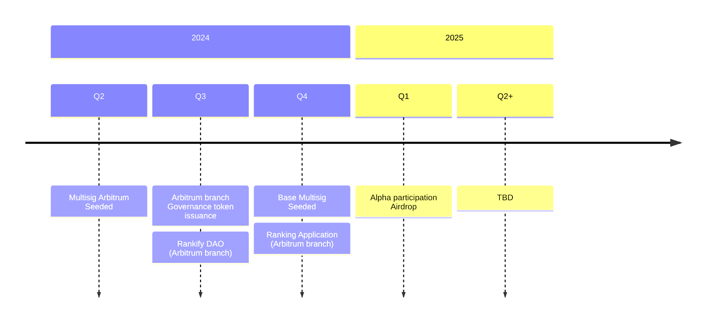

# Governance

Rankify governance is Rankify itself. We are pioneering the way by starting from a multi party controlled wallet, that was seeded by Gitcoin grants and it will gradually evolve into interlinked autonomous organizations infrastructure network.

## Progressive decentralization

Definition of progressive decentralization is given as ability for the system to evolve from centralized to decentralized state. Rankify as protocol allows establishing Peer-to-Peer communications on Entity level without sacrificing for security. This is achieved by using Multisignature wallet that represents decentralized organization branches.

### Sub DAOs (Cells)

Sub DAOs, or also referred as [Cells](/architecure/#cells) are autonomous bodies that can act on their own. Sub DAOs are specifically fetched to service some narrowed specialty need of the organization and represent faster, more specialized units that can take decisions more promptly, have required permissions available from parent DAO as well as they have ability to recursively repeat decentralization process, breaking it down to atomic pieces.

Linkage between parent organization and Cells is done by having a "tournament", each of whose is a [Rankify Application](/architecure/applications)

### Sub DAO Tokenomics

Under a protocol, as DAO-cell creates new and new cells, it actually does not delegate any of control over itself other rather than that it is connected to it's sub-ordinate DAOs only via multi-sig wallet, which only may be controlling some of the sub-dao governance token issuance parameters as well as pre-definitions.

Such sub-ordinates have no value on it own, they do not change any of the parent DAO governance parameters and they are not able to issue any of the governance tokens on their own either completely, or until some internal growth stage. There are no initial coin offerings available to such _generated_ DAOs, instead [ACID](https://rankify.it/research/paper) games are applied to generate such fully autonomously.

!!! note

    In short, outcome of using the [ACID](https://rankify.it/research/paper) protocol is that participants willing to become DAO members must enter a tournament, which will take their bets and mint award tokens to the winners.

A sybil attack resistance as per ACID is expressed in contributions members must do in order to participate. Thus, a sybil attack analysis formula can be used to estimate equilibrium point between exchanging parent token directly versus exchanging it via sybil attack on children asset minting schema.

Relation of these values can be estimated by sybil resistance of protocol, and in worst case is exponential: `f(n) = C * N^n`.
Where `f(n)` is the value of the token, `C` is the constant, `N` is the quorum factor and `n` is the number of sub-dao governance votes obtained.

## Decentralization Roadmap

Approximate timeline is as follows:

More detail will be added as we flow through the process.

### Rankify Arbitrum Multisig

First Rankify DAO Multisig is deployed on the Arbitrum network, it's address is `ToDo: Add Address `

### Alpha DAO Arbitrum

Alpha DAO Arbitrum is a first decentralization step. Right now governance process undergoes in the community to define the details of the upcoming setup.
